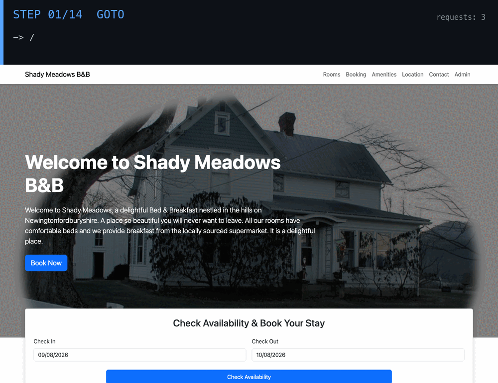

# mockify

Record HTTP traffic from a live web app, then replay it as a local mock server — no live backend required.

## Capture

An agent explores the live app on its own — clicking, filling forms, screenshotting every step — while mockify records every request and response it makes along the way.



Point any MCP-capable agent at it, or skip the external agent and let mockify drive its own:

```bash
grok mcp add mockify -- node /path/to/mockify/dist/cli.js mcp
grok -p "capture https://automationintesting.online with the mockify tools"

# or, without an external agent:
mockify capture --url https://automationintesting.online
```

152 requests · 39 screenshots · booking, contact, and admin flows — real numbers from this run.

## What you get

Every capture is a self-contained directory, saved under a name (`mockify list` shows what's there):

```
captures/demo-grok/
├── traffic.json       # every request/response pair — replayed byte-for-byte
├── screenshots/        # one PNG per interaction step, in order
├── observations.json   # what the agent saw and decided at each step
├── manifest.json       # session metadata: target URL, counts, timestamp, redaction flag
└── synthetic/
    └── index.json       # inferred endpoint templates + response shapes (loaded at replay)
```

## captures/ — before you commit one

A capture is a folder of raw traffic from a real, often-authenticated session — treat it like you would any other file that might hold credentials, because it can. `--storage-state <path|keychain:name>` (see [Agent capture & MCP](#agent-capture--mcp)) starts the browser already logged in, and whatever that session sends — bearer tokens, session cookies, API keys — can end up in a request or response body that gets recorded.

By default, mockify redacts credential-looking values before `traffic.json` is ever written to disk:

- Request/response body fields whose key looks secret — `token`, `password`, `apiKey`/`api_key`, `secret`, `authorization`, `session`, `bearer` (case-insensitive, nested objects included) — have their value replaced with `"[REDACTED]"`. The key and the surrounding shape are preserved, so replay still works.
- Request and response headers — `Authorization`, `Cookie`, `Set-Cookie`, `X-Api-Key`, `X-CSRF-Token`, and similar credential-bearing header names — get the same treatment. A `Set-Cookie` that recorded several cookies at once still replays as that many (fake) cookies, not one.

Every capture's `manifest.json` records whether redaction ran: `"redaction": true` (default) or `"redaction": false` (you passed `--no-redact`). Check that field — or just grep the capture — before pushing a `captures/` directory to a shared repo.

`--no-redact` (agent and manual `mockify capture`, or `MOCKIFY_NO_REDACT=1` for any capture path, including `mockify mcp`'s `capture_start`) turns redaction off and writes raw values — only do this for a capture you're not going to commit, e.g. one you're inspecting locally to debug a replay mismatch.

## Expansion

mockify doesn't just replay what it saw — it can answer requests it never recorded, two different ways, and every response says which one answered it.

**An inferred implementation** (`mockify infer <name>`) has an LLM write real code from the capture — actual routing and an in-memory store, not a lookup table — trained on part of the traffic and graded against the rest (a held-out split, plus a static scan) so memorization gets caught rather than shipped. Because it's real state, it can do what pure replay never could: `POST` a new resource, then `GET` it back. `mockify validate <name> [--impl <path>]` runs the same grading harness against any implementation on demand.

**Shape synthesis** (automatic, no LLM involved) notices that `/api/room/1`, `/api/room/2`, and `/api/room/3` are one *endpoint template* (`/api/room/{id}`) and learns the shape of their responses. Ask for `/api/room/7`, never recorded, and you still get a plausible response, generated deterministically (a seeded PRNG) from that observed shape — generated data, never real data, no live backend involved.

When an inferred implementation is loaded, it answers first — it's the only tier that can stay *self-consistent* across a sequence of requests (real routing + an in-memory store, so a `POST` and the `GET` that follows agree with each other). Recorded traffic backs it up for anything it declines; shape synthesis is the last resort. Every response carries `X-Mockify-Tier: implementation|recorded|synthetic`; synthesized responses also keep the older `X-Mockify-Synthetic: true` header:

```bash
$ curl -i localhost:3456/api/room/1     # implementation loaded — real routing, not a lookup table
X-Mockify-Tier: implementation
{"roomid":1,"roomName":"101","roomPrice":100, ...}

$ curl -i localhost:3456/api/room/7     # never recorded — synthesized, 200 OK
X-Mockify-Tier: synthetic
X-Mockify-Synthetic: true
{"roomid":7,"roomName":"103","roomPrice":132, ...}
```

`mockify replay --mode record` skips the implementation and synthesis tiers entirely and replays only what was captured, byte-for-byte — reach for it when a test needs exact determinism more than a coherent, stateful replica.

`mockify capture` runs synthesis automatically (failures are non-fatal); regenerate by hand with `npx mockify synthesize --data captures/<name>`. `MOCK_SYNTHETIC=0` disables synthesis; `GET /_synthetic` and `GET /_impl` report what's loaded and hit counts for each tier.

## OpenAPI export

`mockify openapi <name|path> [--out <path>]` turns a capture straight into an OpenAPI 3.1 document — the same endpoint templates and inferred response shapes that power synthetic replay (`src/synthesize/`), serialized as an API spec instead of loaded into the mock server. It doesn't require `mockify synthesize` to have run first; it re-derives templates from `traffic.json` itself.

```bash
npx mockify openapi demo-grok                        # writes captures/demo-grok/openapi.yaml
npx mockify openapi demo-grok --out api.json          # JSON instead of YAML — picked from --out's extension
```

Each endpoint template becomes a path item: repeated numeric/UUID path segments (`/api/room/1`, `/api/room/2`, ...) become a `{roomId}`-style path parameter, query string keys observed across the group's requests become query parameters (required only when every request carried them), and a captured `POST`/`PUT`/`PATCH` body becomes a `requestBody` schema (`application/json` or `application/x-www-form-urlencoded`, detected from the request's `Content-Type` header when captured, or sniffed from the body otherwise). Every distinct status code observed for a template — not just the modal one synthesis picks — gets its own response entry with a JSON Schema built from the same shape inference synthesis uses; response headers are included per-status when format v2 header capture (`requestHeaders`/`responseHeaders`) is present, but are never required. Output is YAML by default (mockify has no YAML dependency — `src/openapi/yaml.ts` hand-rolls a small block-style serializer for exactly this); pass `--out something.json` to get JSON instead.

```yaml
openapi: 3.1.0
info:
  title: demo-grok
  version: 0.0.0
paths:
  /api/room/{roomId}:
    get:
      operationId: get_api_room_roomId
      parameters:
        - name: roomId
          in: path
          required: true
          schema:
            type: integer
            examples:
              - 1
              - 2
              - 3
      responses:
        "200":
          description: OK
          content:
            application/json:
              schema:
                type: object
                properties:
                  roomid: { type: number, examples: [1, 2, 3] }
                  roomName: { type: string, examples: ["101", "102", "103"] }
                required: [roomid, roomName]
```

## Watching an inferred implementation work

`mockify validate` grades a generated implementation on traffic it never saw during inference — a held-out split, not the training pairs — then the GIF proves the state is real: a message count read before a `POST`, the same `POST` answered by the implementation tier, and the count read again afterward, up by one.


## Replay

```bash
mockify list                            # table of saved captures: target, counts, timestamp
mockify replay demo-grok                # serves it on http://localhost:3456, all tiers active
mockify replay demo-grok --mode impl    # implementation → recorded, no shape synthesis
mockify replay demo-grok --impl <path>  # try a candidate implementation without moving files
mockify replay demo-grok --latency      # replay each response's real captured delay too
```

No env vars, no config file — `--port` overrides the default if you need it. The banner states which tiers are active and, when an implementation is loaded, its train/holdout pass rate and hardcoding verdict from `impl/report.json` (a `likely_hardcoded` verdict prints a visible warning rather than serving silently). `--mode` (default `auto`) picks the pipeline: `auto` is the full `implementation → recorded → synthetic` chain; `record` replays only what was captured, 404 otherwise (byte-exact replay for regression tests, when determinism matters more than coherence); `impl` adds the inferred implementation but skips synthesis; `synthetic` skips the implementation — the escape hatch if a generated one misbehaves.

**Latency replay** is opt-in and off by default — every response is instant unless you ask otherwise. Captures record `tsStart`/`tsEnd` per entry (the real request-sent/response-completed timestamps); `--latency` replays each recorded entry's own observed duration before answering, and an unrecorded (synthetic-tier) request replays the median observed duration for that endpoint template instead, since there's no single entry to read a duration off of. `--speed <factor>` scales the delay and implies `--latency`: `2` replays at twice real speed (half the delay), `0.5` at half real speed (double the delay); default `1` is real-time. `--no-latency` disables delay replay outright (equivalent to infinite speed — also the default, so it's mostly useful to override a script that otherwise passes `--speed`). Every delay is capped at 30s regardless of what was actually observed, and an entry with missing/invalid timestamps (pre-`tsStart`/`tsEnd` captures) always answers instantly.


## Replay against a live target

`mockify replay <name> --against <url>` fires every request in a capture at a real, live target instead of serving them from a mock server, and diffs each response against what was originally recorded — status, structure, and values (`src/diff/engine.ts`). This is the deterministic port of specify's agent-driven `specify replay --capture --url`: no LLM, no cost, same comparator every run.

```bash
mockify replay demo-grok --against https://staging.example.com          # text report
mockify replay demo-grok --against https://staging.example.com --json   # machine-readable summary + per-request diffs
mockify replay demo-grok --against http://localhost:8080 --header "Authorization: Bearer <token>"
```

Exit code is `0` if every request matched, `1` on any mismatch or request that failed to fire. `--timeout <ms>` bounds how long a single request is allowed to hang (default 15000). `--header "Name: value"` is repeatable and always wins over a recorded header of the same name — use it to supply real auth when the recorded header was redacted (see below).

Two kinds of fields are never treated as a mismatch, and are listed separately (`ignoredFields`) rather than silently dropped:
- A recorded field whose value is the redaction placeholder `"[REDACTED]"` — a redacted capture can never match a live value by construction, so it's excluded from diffing entirely.
- A field that looks volatile by name (`id`, `createdAt`, `sessionToken`, `csrf`, ...) or by value shape (UUID, ISO timestamp, plausible unix-epoch integer) — the same tolerance specify's own replay prompt applies ("ignore timestamps, session IDs, CSRF tokens").

## Quickstart

```bash
npm install && npm run build
npx mockify capture --url https://app.example.com            # agent-driven (needs an API key or claude login; see below)
npx mockify capture --url https://app.example.com --manual   # or drive a real browser yourself, no agent needed
npx mockify list
npx mockify replay app-example-com
```

`mockify serve [--data <path>] [--port N]` is a back-compat alias for `replay` (`--data` takes a `traffic.json` file or a capture directory; omitted, it searches `<cwd>/captures/` for the newest one).

## Agent capture & MCP

`mockify capture --url <url>` is agent-driven by default: a Claude agent (`src/agent/runner.ts`) drives a real Chromium browser, surveying the app's pages and then exercising its list/detail/create/update/delete flows, pagination, filters, and error states (`src/agent/prompts.ts`). **Authentication**: `ANTHROPIC_API_KEY`, a `CLAUDE_CODE_OAUTH_TOKEN` (`claude setup-token`), or an ambient `claude login` session — first one found wins. **Options**: `--name <name>` (default: slugified from `--url`), `--output <dir>` (bypasses naming entirely), `--headed`, `--storage-state <path|keychain:name>` / `--save-storage-state <path|keychain:name>`, `--timeout <seconds>`, `--no-redact` (skip credential redaction — see [captures/ — before you commit one](#captures--before-you-commit-one)). **Manual fallback**: `--manual` opens a visible Chromium window for you to drive by hand (`src/recorders/browse-and-capture.ts`) — no API key needed. It shares the same CaptureCollector as agent mode, so traffic capture, console logging, redaction, and `--storage-state` / `--save-storage-state` all work identically; on top of that it takes a screenshot on every navigation (including SPA route changes) and after substantial JSON API responses, autosaves every 30s, and writes `js-sources.json` (script URLs seen on visited pages). Press Ctrl+C when you're done browsing to save the capture. **Env**: `MOCKIFY_MAX_TURNS` (default 200), `MOCKIFY_MAX_BUDGET_USD` (default 5), `MOCKIFY_CAPTURE_HOST_FILTER`, `MOCKIFY_MODEL` (default `claude-opus-4-6`).

`mockify mcp` starts a stdio [MCP](https://modelcontextprotocol.io) server exposing `capture_start`, `capture_finish`, `get_capture_guide`, and the same 13 `browser_*` tools as the built-in agent path — so grok, Codex, Claude Code, or any other MCP-capable agent can drive a capture session directly (register command shown at the top). `capture_start` takes the same `name`/`outputDir` as the CLI; `capture_finish` reports back the name it was saved under:

```
capture_start { "url": "..." } → read get_capture_guide → explore with browser_click/browser_fill/browser_goto/etc. → capture_finish { "summary": "..." }
```

## The traffic.json format

A JSON array of request/response pairs, typed as `CapturedTraffic` in `src/format/types.ts`. Produced by mockify's own recorders and also by specify's capture command — mockify's recorders and mock server were extracted from specify and share this format with it.

```json
{
  "url": "https://example.com/api/widgets",
  "method": "GET",
  "status": 200,
  "contentType": "application/json; charset=utf-8",
  "responseBody": "{\"widgets\":[...]}",
  "requestHeaders": { "accept": "application/json" },
  "responseHeaders": { "content-type": "application/json; charset=utf-8", "access-control-allow-origin": "*" }
}
```

`requestHeaders`/`responseHeaders` are optional — every capture predating this field simply lacks it, and replay treats that the same as "no header data" rather than failing. `manifest.json`'s `formatVersion` records which shape a capture was written in (`CURRENT_CAPTURE_FORMAT_VERSION` in `src/format/types.ts`); absent means version 1, before headers existed. Replaying an entry replays every captured response header — `Set-Cookie` (including several at once), CORS's `Access-Control-Allow-*`, and so on — not just `Content-Type`; hop-by-hop headers (`Transfer-Encoding`, `Connection`, `Content-Length`, ...) are stripped and left to Node to manage. Matching an incoming request against multiple recorded entries on the same route additionally considers recorded request headers with SUBSET semantics — a recorded entry matches when its own significant headers (excluding volatile ones like `User-Agent`/`Date`/`Host`, and credential-bearing ones, which are already redacted to a placeholder) are all present in the incoming request with the same value — falling back permissively to the full candidate list when nothing matches, so old captures and partial header replication both keep working.

## Fault injection & diagnostics

Set `MOCK_FAULT_RATE` (0–1) to randomly inject failures instead of replaying real responses; `MOCK_FAULT_TYPES` restricts fault types (subset of `302,500,timeout,empty,malformed`; default: all):

```bash
MOCK_FAULT_RATE=0.1 npx mockify replay demo-grok
```

**Diagnostics** (no session cookie required): `GET /` (route index), `GET /_traffic` (raw traffic data), `GET /_faults` (fault config and stats), `GET /_sessions` (active sessions), `GET /_synthetic` (loaded synthetic templates and hit count), `GET /_impl` (loaded implementation path + `report.json` summary).

**Advanced env knobs**, layered on top of `replay`/`serve`, not needed for normal use (see `src/mock-server.ts`): `PORT`, `MOCK_DATA_PATH` (overridden by `replay`'s `<name>`/`--port`), `MOCK_AUTH` (opt-in login gate, default off), `MOCK_SESSION_COOKIE_NAME`, `MOCK_SESSION_COOKIE_2_NAME`, `MOCK_SESSION_TTL_MS`, `MOCK_LOGIN_PATH`, `MOCK_POST_LOGIN_REDIRECT`, `MOCK_REFRESH_PATH`, `MOCK_SYNTHETIC` (`0` disables synthetic replay), `MOCKIFY_IMPL_TIMEOUT_MS` (wall-clock budget for the implementation tier's `handle()` call before it's treated as hung and skipped, default 2000ms), `MOCKIFY_CAPTURES_DIR` (default `<cwd>/captures`).

## Spec & roadmap

`mockify.spec.yaml` is a starter behavioral spec in specify's v2 format, verifiable with `specify verify --spec mockify.spec.yaml`. Known gaps:

- JSON request-body matching (currently form-encoded only)
- Body matching for PUT/PATCH/DELETE (currently routed through GET matching)
- Sequence-aware/stateful replay

## License

GPL-3.0. See [LICENSE](./LICENSE).
