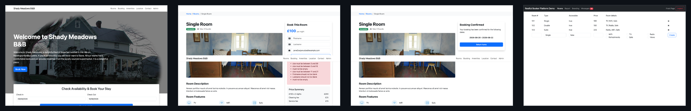

# mockify

Record HTTP traffic from a live web app, then replay it as a local mock server — no live backend required.

## Point any agent at a site

Capture is agent-driven: a headless browser explores the app — clicking, filling forms, screenshotting every step — while mockify records every request and response for replay. Point grok (or Codex, or Claude Code) at it over MCP:

```bash
grok mcp add mockify -- node /path/to/mockify/dist/cli.js mcp
grok -p "capture https://automationintesting.online with the mockify tools"
```



152 requests · 39 screenshots · booking, contact, and admin flows — real numbers from this run.

## Replay it, then go beyond it

Everything recorded above replays byte-for-byte from a local mock server — no live backend, no network. But mockify's flagship trick is generalizing *past* the literal capture: only rooms 1-3 were ever recorded, and room 7 still works.

```bash
$ curl localhost:3456/api/room/1   # recorded — replayed byte-for-byte
{"roomid":1,"roomName":"101","roomPrice":100,"type":"Single", ...}

$ curl localhost:3456/api/room/7   # never recorded — synthesized on the fly, 200 OK
{"roomid":7,"roomName":"103","roomPrice":132,"type":"Single", ...}   # X-Mockify-Synthetic: true
```

mockify notices `/api/room/1`, `/api/room/2`, `/api/room/3` are one *endpoint template* (`/api/room/{id}`) and learns the shape of their responses. Any other id gets a plausible response generated (deterministically, via a seeded PRNG) from that observed shape — generated data, never real data, no live backend involved. A recorded exact match always wins when one exists; synthesis only kicks in on a miss. `mockify capture` runs this generation automatically (failures are non-fatal); regenerate by hand with `npx mockify synthesize --data captures/2024-01-01_12-00-00`, which writes `<captureDir>/synthetic/index.json` (loaded by the mock server at startup, see `src/synthesize/`) and `synthetic/examples.json` (human-inspectable, never read at runtime). `MOCK_SYNTHETIC=0` disables it; `GET /_synthetic` lists loaded templates and hit count.


## Quickstart

```bash
npm install && npm run build

npx mockify capture --url https://app.example.com            # agent-driven (needs an API key or claude login; see below)
npx mockify capture --url https://app.example.com --manual   # or drive a real browser yourself, no agent needed
npx mockify serve --data captures/2024-01-01_12-00-00 --port 3456
```

If `--data` is omitted, the server searches `<cwd>/captures/` for a `traffic.json` (most recent timestamped subdirectory wins). `--data` accepts either a `traffic.json` file directly or a capture directory containing one.

## Agent capture

`mockify capture --url <url>` is agent-driven by default: a Claude agent (`src/agent/runner.ts`) drives a real Chromium browser, surveying the app's pages and then exercising its list/detail/create/update/delete flows, pagination, filters, and error states. Traffic, console logs, and screenshots are recorded automatically; see `src/agent/prompts.ts` for the exploration strategy.

**Authentication**: `ANTHROPIC_API_KEY`, a `CLAUDE_CODE_OAUTH_TOKEN` (`claude setup-token`), or an ambient `claude login` session — first one found wins. **Options**: `--output <dir>` (default `captures/<ISO-timestamp>`), `--headed`, `--storage-state <path|keychain:name>` / `--save-storage-state <path|keychain:name>`, `--timeout <seconds>`.

**Manual fallback**: `--manual` skips the agent and opens a visible Chromium window for you to drive by hand — no API key needed (`src/recorders/browse-and-capture.mjs`).

Environment variables: `MOCKIFY_MAX_TURNS` (default 200), `MOCKIFY_MAX_BUDGET_USD` (default 5), `MOCKIFY_CAPTURE_HOST_FILTER` (extra domains, or `*` to disable filtering), `MOCKIFY_MODEL` (default `claude-opus-4-6`).

## Drive it with any agent (MCP)

`mockify mcp` starts a stdio [MCP](https://modelcontextprotocol.io) server exposing `capture_start`, `capture_finish`, `get_capture_guide`, and the same 13 `browser_*` tools as the built-in agent path — so grok, Codex, Claude Code, or any other MCP-capable agent can drive a capture session directly, recorded exactly like the Claude Agent SDK path above (register command shown at the top).

```
capture_start { "url": "..." } → read get_capture_guide → explore with browser_click/browser_fill/browser_goto/etc. → capture_finish { "summary": "..." }
```

## The traffic.json format

A JSON array of request/response pairs, typed as `CapturedTraffic` in `src/format/types.ts`. Produced by mockify's own recorders and also by specify's capture command — mockify's recorders and mock server were extracted from specify and share this format with it.

```json
{ "url": "https://example.com/api/widgets", "method": "GET", "status": 200, "contentType": "application/json; charset=utf-8", "responseBody": "{\"widgets\":[...]}" }
```

## Fault injection

Set `MOCK_FAULT_RATE` (0–1) to randomly inject failures instead of replaying real responses:

```bash
MOCK_FAULT_RATE=0.1 npx mockify serve --data captures/traffic.json
# or: npm run serve:chaos
```

`MOCK_FAULT_TYPES` restricts fault types (subset of `302,500,timeout,empty,malformed`; default: all). Other env vars (see `src/mock-server.ts`): `PORT`, `MOCK_DATA_PATH`, `MOCK_AUTH` (opt-in synthetic login gate, `1` to enable, default off), `MOCK_SESSION_COOKIE_NAME`, `MOCK_SESSION_COOKIE_2_NAME`, `MOCK_SESSION_TTL_MS`, `MOCK_LOGIN_PATH`, `MOCK_POST_LOGIN_REDIRECT`, `MOCK_REFRESH_PATH`, `MOCK_SYNTHETIC` (`0` disables synthetic replay, default on).

**Diagnostics** (no session cookie required): `GET /` (route index), `GET /_traffic` (raw traffic data), `GET /_faults` (fault config and stats), `GET /_sessions` (active sessions), `GET /_synthetic` (loaded synthetic templates and hit count).

## Spec

`mockify.spec.yaml` is a starter behavioral spec in specify's v2 format, verifiable with `specify verify --spec mockify.spec.yaml`.

## Roadmap

- Header capture and replay (cookies/auth/CORS not currently replayable)
- JSON request-body matching (currently form-encoded only)
- Body matching for PUT/PATCH/DELETE (currently routed through GET matching)
- Latency simulation from `tsStart`/`tsEnd` (captured but unused)
- Sequence-aware/stateful replay

## License

GPL-3.0. See [LICENSE](./LICENSE).
